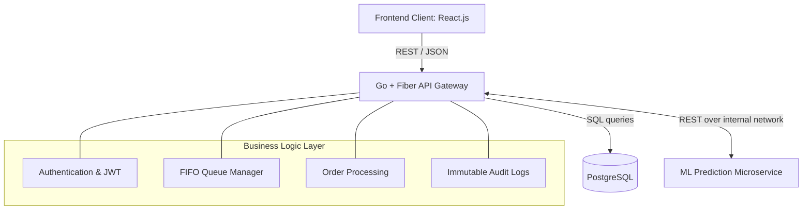

# 🚀 Smart Cafeteria - Go Backend

[](https://golang.org/)
[](https://supabase.com/)
[](https://gin-gonic.com/)

The core API and business logic gateway for the Smart Cafeteria Management System.

---

## 🏗️ 1. Architecture Overview (System Design)

The backend acts as the central orchestrator for the entire organization.



- **Microservice Design:** The backend talks to the Python ML model over a REST protocol.
- **Database:** PostgreSQL (via Supabase) serves as the persistent truth for users, rules, orders, and audits.
- **Security:** Requires `sslmode=require` for all database interactions. Strict enforcement of data immutability for audit logs.

---

## 💻 2. Developer Documentation

### Prerequisites
- [Go](https://golang.org/) (1.23+)
- Docker Desktop
- A valid `.env` file containing Supabase DB credentials.

### Local Setup
**Option 1: Docker (Recommended)**
```bash
docker build -t cafeteria-backend .
docker run -d -p 5000:5000 --env-file .env cafeteria-backend
```

**Option 2: Native Go**
```bash
go mod download
go run cmd/server/main.go
# (Or use `air` for hot-reloading)
```

### Directory Structure
- `cmd/server/`: The main entry point. Initializes Fiber and Database.
- `internal/handlers/`: The core business logic controllers (Booking, Auth, Menu).
- `internal/middleware/`: JWT verification, Role checks, CORS.
- `internal/database/`: PostgreSQL connection and seeding scripts.

### CI/CD Pipeline
Configured via `.github/workflows/ci.yml`. Triggers on push/PR to `main`.
1. **Lint/Vet:** Runs `go vet ./...`
2. **Build:** Compiles binary for Ubuntu.
3. **Dockerize:** Builds the production `smart-cafeteria-backend` image.

---

## 🔌 3. API Documentation (Reference)

All protected operations require a valid JSON Web Token in the header: 
`Authorization: Bearer <token>`

### Authentication & Users
- `POST /api/auth/login` : Authenticate. Returns JWT.
- `POST /api/auth/totp/setup` : Init 2FA process.
- `GET /api/admin/users` : (Admin) List all users.

### Orders & Tokens
- `POST /api/bookings` : Create a meal order. Automates point redemption and generates a token.
- `GET /api/queue/my-token` : Get specific queue position and wait time.
- `GET /api/queue/status` : View overall queue length (FIFO).

### AI & Operations
- `GET /api/forecasts/day` : Fetches demand predictions by calling the Python ML microservice.
- `GET /api/admin/audit-logs` : Fetch immutable system modification logs.

---

## 🛡️ 4. System Integrity (Ethics)
1. **FIFO Queue:** Hard-coded sequential processing. No manual reordering permitted.
2. **Audit Trails:** All setting changes, cancellations, and logins are logged with timestamps.
3. **Incentive Limits:** Backend enforces rate limits on daily attendance rewards to prevent abuse (`#10643`).
